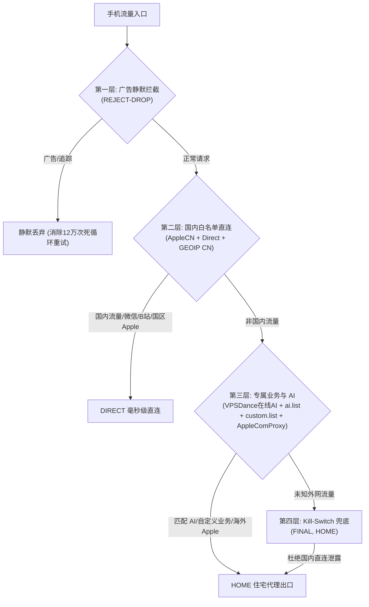

# 📱 iOS 手机端（小火箭 Shadowrocket）防封优化与日志体检深度报告

> 本文档基于对真实导出的网络日志数据库（`proxy.db` 70.3MB，154,219 次代理请求；`dns.db` 3,591 条 DNS 解析）的逆向挖掘分析，结合 Anthropic Claude Code / OpenAI 2026 最新风控防御策略，系统性重构 `apple.conf` 与 `apple-rules/`。

---

## 📊 一、 真实流量体检审计（37 小时连续监控）

从 `C:\Users\H\Desktop\新建文件夹` 下提取的数据库分析，全机产生 154,219 次请求，真实画像如下：

```
总请求量：154,219 次
├── 1. 广告与遥测拦截 (REJECT)       : 125,560 次 (81.4%) 🔴 异常暴增
├── 2. 国内 IP 直连 (GEOIP,CN)       :  17,911 次 (11.6%)
├── 3. 兜底直连 (FINAL,DIRECT)       :   9,835 次 ( 6.4%) 🔴 封号最大死穴
└── 4. 住宅/节点代理 (HOME/PROXY)     :     913 次 ( 0.6%)
```

---

## 🔍 二、 真实日志揭露的 5 大致命漏洞

### 1. `FINAL,DIRECT` 严重外泄陷阱 —— Claude / 海外封号第一杀手
* **原配置**：
  ```ini
  GEOIP,CN,DIRECT,no-resolve
  FINAL,DIRECT
  ```
* **实测日志数据**：短短 37 小时内，多达 **9,835 次请求、涉及 674 个不同域名**跌入 `FINAL,DIRECT`！
* **致命机理**：
  `GEOIP,CN,DIRECT,no-resolve` 启用了 `no-resolve`。当一个域名（如未被旧规则收录的海外新 API、Claude 新接口、Stripe 支付）发起请求时，小火箭不会主动解析其真实 IP，因此直接跳过 `GEOIP,CN`，**全部滑落进 `FINAL,DIRECT`**！
* **严重后果**：海外 AI 服务直接使用国内运营商（电信/移动蜂窝网络）真实 IP 裸连，瞬间被 Anthropic 的风控 Agent 捕获并封号。

### 2. DNS 明文裸奔至本地甘肃电信
* **原配置**：`dns-server = system`
* **实测日志数据**：所有 DNS 解析被发往 `61.178.0.93`、`202.100.64.68`（甘肃电信）以及本地网关 `192.168.1.1`。
* **严重后果**：用户访问的海外域名全部向国内 ISP 明文暴露，且随时面临 DNS 污染与劫持。

### 3. IPv6 AAAA 记录穿透（229 次漏网）
* **实测日志数据**：虽然写了 `ipv6 = false`，但系统级 DNS 依然向运营商发起了 **229 次 Type 28 (AAAA) 查询**，`gateway.icloud.com` 成功获取到了 IPv6 地址 `2403:300:1366::2:4`。
* **严重后果**：在 4G/5G 移动蜂窝网络和双栈 Wi-Fi 下，AAAA 记录直连会绕过 IPv4 住宅代理隧道，暴露真实位置。

### 4. 广告拦截引发狂暴死循环重试（单域名 12.4 万次轰炸，严重耗电发热）
* **实测日志数据**：全机 15.4 万次请求中，**仅 `adsmind.gdtimg.com`（腾讯视频/开屏广告）就占了 124,031 次（80.4%）**！
* **致命机理**：原配置使用 `REJECT`，小火箭直接返回 TCP RST，App 认为网络闪断，每隔数十毫秒发起狂暴重试，陷入死循环！手机极速发热、耗电飞快。

### 5. Apple 服务的割裂与混乱（3,096 次裸连）
* **实测日志数据**：112 个 Apple 相关域名（共 3,096 次请求）全部无规则可依跌落至 `FINAL,DIRECT`。
* **后果**：国区 App Store / 地图缺少高速直连规则；而海外关键服务（如 `gateway.icloud.com` iCloud 私密转送与邮件保护）全部混在直连里，未走代理。

---

## 🛠️ 三、 终极重构架构方案（方案 1：极速高精混合流 + 社区在线 AI 全家桶）

### 1. 四层漏斗分流模型



### 2. 核心改进落地项

| 维度 | 改造前 | **改造后** | 防封 / 体验收益 |
| :--- | :--- | :--- | :--- |
| **DNS 架构** | `dns-server = system` (甘肃电信) | **阿里/腾讯 DoH 加密 DNS**<br/>`https://223.5.5.5/dns-query` | 彻底切断运营商偷窥与 DNS 污染 |
| **广告拦截动作** | `REJECT` (回包 RST) | **`REJECT-DROP` (静默丢弃)** | 彻底平息 12.4 万次狂暴重试，大幅提升续航降温 |
| **国内直连白名单** | 仅依赖 `GEOIP,CN` (且带 `no-resolve`) | **`blackmatrix7/China.list` + `apple-cn-direct` + `GEOIP,CN,DIRECT`** | 国内所有 App 0 误伤秒开，去掉了 `no-resolve` 兜底 |
| **AI 规则源** | 纯静态本地维护，易落后 | **接入社区每日在线自动更新源**<br/>`VPSDance/ai-proxy-rules` (100+ AI) | 网友每天维护，手机端每日自动同步最新大模型 |
| **新兴 AI (如 muse.ai)** | 社区未收录即裸连封号 | **双保险：`custom.list` 优先直达 + `FINAL,HOME` 兜底** | 即使全网都未收录，也绝对 100% 走住宅代理 |
| **终极兜底策略** | `FINAL,DIRECT` 🔴 (致命漏洞) | **`FINAL,HOME` 🟢 (Kill-Switch)** | 住宅代理若挂直接断网，杜绝真实 IP 裸奔 |

---

## 📁 四、 本次优化涉及的文件清单

1. [`apple.conf`](file:///e:/20_code/03_github/conf/apple.conf)：小火箭主配置文件，升级 DoH、REJECT-DROP、国内白名单与 Kill-Switch；
2. [`apple-rules/apple-cn-direct.list`](file:///e:/20_code/03_github/conf/apple-rules/apple-cn-direct.list)：国区 Apple 直连清单（App Store、地图、天气）；
3. [`apple-rules/apple-com-proxy.list`](file:///e:/20_code/03_github/conf/apple-rules/apple-com-proxy.list)：海外 Apple 与 iCloud 私密转送专线；
4. [`apple-rules/custom.list`](file:///e:/20_code/03_github/conf/apple-rules/custom.list)：个人业务同步清单，新增 `novproxy`、`oyunfor`、`iyzico`、`muse.ai`；
5. [`windows.js`](file:///e:/20_code/03_github/conf/windows.js) 与本地运行态 [`Script.js`](file:///C:/Users/H/AppData/Roaming/io.github.clash-verge-rev.clash-verge-rev/profiles/Script.js)：同步接入 `communityAi`（VPSDance 全家桶）与 `muse.ai` 直达；
6. 瘦身清理：安全移除了已被废弃合并的 `canva.list`、`github.list`、`google.list`、`youtube.list`。

---

## 📲 五、 小火箭客户端使用指南

1. **导入配置**：
   在 Shadowrocket 中，点击底部导航 **配置** -> 右上角 **+** -> 填入 `apple.conf` 的远程链接（或直接从剪贴板覆盖）。
2. **开启规则自动更新**：
   在小火箭中点击 **配置** -> 找到当前配置 -> 点击 **规则** -> 开启右上角 **自动更新**。
   每天凌晨小火箭将自动拉取 `VPSDance` 社区 AI 规则与 `blackmatrix7` 规则，无需任何人工操作！
3. **填入住宅节点**：
   在小火箭首页节点列表中添加您的静态住宅 Socks5 代理，或在 `[Proxy]` 中填入并在 `HOME` 组中选中即可。
