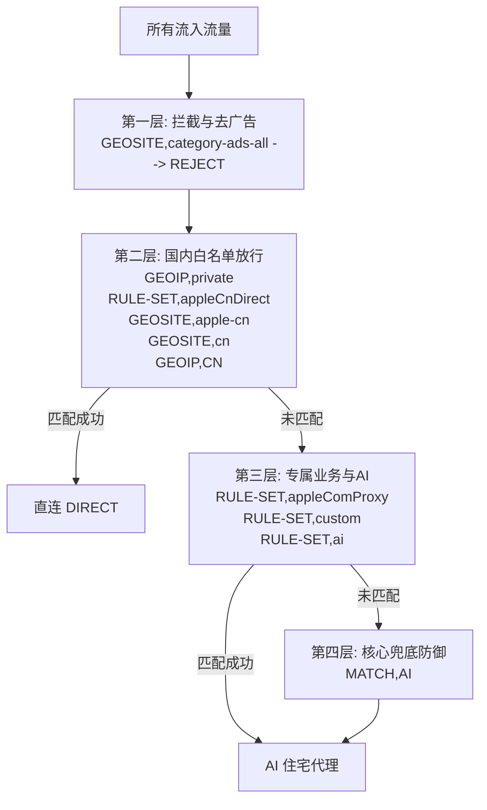

# Windows Clash Verge 住宅代理与防封隔离优化方案设计与实现

> **文档路径**：`.dosc/windows-optimization.md`  
> **更新时间**：2026-09-29  
> **关联配置**：`windows.js`、`windows-rules/*`  
> **设计目标**：针对高风控大模型（Anthropic Claude / Claude Code 等）使用场景，实现 **100% 住宅代理落地**、**严格 Kill-Switch（故障断网防泄漏）**、**长连接防抖动** 以及 **规则集轻量化高可维护**。

---

## 1. 核心需求与背景

在进行 Claude / Claude Code 等高敏感 AI 开发时，Anthropic 具备极其严密的多层风控（ASN 纯净度检测、IP 变动追踪、IPv6 规则绕过检测、WebRTC 探测、邮件隐形定位器追踪等）。

系统必须严格满足以下硬性条件：
1. **单点纯净落地**：所有境外流量必须全部通过静态住宅代理（Socks5）发出，严禁将机场机房 IP 暴露给平台。
2. **绝对断网机制（Kill-Switch / Fail-Closed）**：当住宅代理服务器宕机、网络故障或欠费时，必须**立即彻底断网**，严禁以任何形式回退到直连或机场节点，杜绝中国公网 IP 裸奔。
3. **长连接稳定保障**：消除由于多路测速抖动引起的前置跳板频繁切换，保障 TCP/WebSocket 长连接不中断。
4. **代码开源/脱敏友好**：在 GitHub 公开仓库中，服务器地址、端口及凭据保持留空，且在脱敏状态下具备安全防御机制，防止客户端校验空节点崩溃。

---

## 2. 改造前问题深度诊断

基于对本地运行日志（`latest.log`、`sidecar_latest.log`）及 Mihomo 实时连接抓包的深度分析，原配置存在以下致命缺陷：

| 序号 | 漏洞/隐患 | 现象分析 | 严重等级 |
| :--- | :--- | :--- | :--- |
| **1** | **兜底规则走直连，境外流量裸奔** | 原规则为 `MATCH,直连` 且无国内白名单。任何未收录在规则集里的生僻外网、新域名或邮件打点图片，会直接以国内真实 IP 直连访问；且住宅代理故障时依然畅通直连。 | **P0（致命泄露）** |
| **2** | **IPv6 规则绕过隐患** | Clash Verge 客户端默认启用了 `ipv6: true`。Anthropic 同时存在 A（IPv4）和 AAAA（IPv6）记录，客户端若通过 IPv6 发起请求，流量将直接绕过 IPv4 住宅代理走国内 IPv6 直连。 | **P0（致命泄露）** |
| **3** | **前置跳板剧烈抖动导致长连接断流** | `AI` 策略组为 `url-test`，容差设置过小（10ms）。实时监控显示 100 多条连接碎裂在 8 个不同跳板上，微小网络抖动导致前置 TCP 频繁重置，Claude 对话频发中断与鉴权报错。 | **P1（严重影响体验）** |
| **4** | **机场虚假提示节点被建链分流** | 订阅里的 `Expire: 2026-10-09`、`Traffic: 672GB` 等到期/流量提示性虚拟节点未被过滤。实测 `gateway.icloud.com` 实际连接到了假节点链上，易引发随机黑洞断流。 | **P1（分流污染）** |
| **5** | **规则集臃肿且静态失效** | `windows-rules` 目录下堆积了 9 个文件，其中包含一个高达 750KB（3.1 万行）的静态死文件 `proxy.yaml`，不仅拖慢启动，且与全量走住宅的架构严重冗余。 | **P2（性能/维护负担）** |
| **6** | **DNS 直连域名解析卡顿** | 开启 `respect-rules: true` 但未配置 `direct-nameserver`，导致国内直连域名解析可能回退向国外 DoH 发起直连请求，造成严重超时。 | **P2（网络卡顿）** |

---

## 3. 架构优化设计（方案 A：Mihomo 原生 Geo 体系 + 极简自定义）

### 3.1 路由分流漏斗模型（四层防御）



1. **第一层（广告与遥测拦截）**：`GEOSITE,category-ads-all,REJECT`。使用 Mihomo 内置库拦截广告打点，防止遥测请求消耗昂贵的住宅代理流量。
2. **第二层（国内白名单放行）**：
   * 局域网私有网段：`GEOIP,private,直连,no-resolve`
   * Apple 国内专属服务：`RULE-SET,appleCnDirect,直连` + `GEOSITE,apple-cn,直连`
   * 国内主流大厂及中国 IP 库：`GEOSITE,cn,直连` + `GEOIP,CN,直连,no-resolve`
3. **第三层（重点专属平台走住宅）**：
   * Apple 海外服务：`RULE-SET,appleComProxy,AI`
   * 自定义重点平台（采购、支付、住宅服务商）：`novproxy`、`oyunfor`、`iyzico`、`chatgpt.site`、`cc.cd`、`miyaip`、`iproyal.cn`、`dnshe.com`
   * 个人自建与 Canva 工作流：`RULE-SET,custom,AI`
   * 大模型专属生态：`RULE-SET,ai,AI`
4. **第四层（绝对 Kill-Switch 兜底）**：`MATCH,AI`。
   * 除上述国内白名单外，未被规则库覆盖的全部外网流量强制走住宅代理；
   * 一旦住宅代理不可用，内核抛出连接超时/重置错误，**彻底断网，杜绝任何直连泄漏可能**。

---

### 3.2 代理策略组改造（`fallback` 主备容灾）

* **放弃 `url-test` 的原因**：
  链式代理的出口 IP **永远固定是同一个住宅代理 IP**。`url-test` 测速仅能反映前置跳板毫秒级的波动，但会不断切断 TCP 会话；同时每隔几分钟对同一住宅端口并发发起近百次测速，易触发服务商并发限流。
* **采用 `fallback` 策略**：
  * **锁定首选跳板**：优先使用第一顺位的高质量跳板，只要不掉线，**永远不切换前置节点**，保障长连接稳固；
  * **故障无缝转移**：当前跳板故障时，自动下移至备用跳板；
  * **全挂彻底阻断**：当住宅代理自身掉线时，所有跳板链全部超时，策略组整体阻断，完美达成 Kill-Switch。

---

### 3.3 节点清洗过滤器（剔除虚拟提示节点）

在 `isCleanSubscriptionProxy` 过滤器中加入正则表达式，将机场常混入订阅的广告与提示性伪节点彻底剔除：
```javascript
// 排除到期时间、剩余流量、官网等无用提示节点
if (/expire|traffic|sync|到期|剩余|流量|官网|更新|通知|倍率|网址|info/i.test(name)) return false;
```
保证链式代理只基于真实的、可通的机场翻墙节点构建。

---

### 3.4 全局关闭 IPv6 与 DNS 加固

1. **强行关闭 IPv6**：
   ```javascript
   config["ipv6"] = false;
   dnsConfig["ipv6"] = false;
   ```
   覆盖 Clash Verge 默认开启的 IPv6，阻断 Anthropic 等服务的 AAAA 请求直连泄露。
2. **补全 `direct-nameserver`**：
   ```javascript
   "direct-nameserver": [...domesticNameservers],
   ```
   开启 `respect-rules: true` 时，保障国内直连域名由阿里/腾讯 DoH 安全快速解析，解决解析卡顿。

---

## 4. 规则集精简重构方案（私有定制 + 社区上游融合）

彻底清理冗余文件，将原先分散且不可自动更新的 9 个文件体系重构为 **私有专属核心库 + 社区上游自动更新库** 的融合架构：

| 规则集标识 | 来源与维护方式 | 承担职责 |
| :--- | :--- | :--- |
| **`reject`** | 社区源（`Loyalsoldier/clash-rules@release/reject.txt`）每日自动更新 | 全网广告拦截与遥测屏蔽，保护隐私并极大节省昂贵的住宅代理流量。 |
| **`direct`** | 社区源（`Loyalsoldier/clash-rules@release/direct.txt`）每日自动更新 | 动态补充国内冷门与新上线域名，确保国内站点 100% 直连不误入住宅代理。 |
| [`ai`](file:///e:/20_code/03_github/conf/windows-rules/ai.yaml) | 私有源（`scripts/build_ai_rules.py` 自动构建） | 聚合 OpenAI、Anthropic、Claude、Cursor 等全球主流大模型规则（已排除 Claude 进程规则避开 TUN 本地回环死锁）。 |
| [`custom`](file:///e:/20_code/03_github/conf/windows-rules/custom.yaml) | 私有源（人工维护 / 脚本同步） | 个人专属全能库：自建服务（hello-shudong 等）、Canva 全量生态、海外支付采购服务（novproxy、oyunfor、iyzico 等）。 |
| [`appleCnDirect`](file:///e:/20_code/03_github/conf/windows-rules/apple-cn-direct.yaml) | 私有极简维护（仅 4 行） | 中国区 Apple 服务直连白名单（`apple.cn`、`appstore.cn` 等）。 |
| [`appleComProxy`](file:///e:/20_code/03_github/conf/windows-rules/apple-com-proxy.yaml) | 私有极简维护（仅 10 行） | 国际区 Apple 服务代理白名单（`apple.com`、`icloud.com` 等）。 |

> **已清理废弃文件**：`proxy.yaml`（750KB）、`google.yaml`、`youtube.yaml`、`github.yaml`、`canva.yaml`。这些静态海外域名已由 `MATCH,AI` 兜底接管或整合进 `custom.yaml`，不再重复下载。

---

## 5. 本地运行与 GitHub 维护指引

1. **GitHub 提交安全机制**：
   `windows.js` 中 `residentialEndpoints` 的 `server: ""` 默认留空，代码内部已添加 `hasValidServer` 校验，脱敏状态下执行时自动将代理列表回退至 `DIRECT`，防止本地或 CI 环境校验空节点报错。
2. **本地生效操作**：
   在本地 Clash Verge 中，打开预处理脚本编辑，填入真实的住宅代理 IP、端口和账号密码后保存，刷新订阅即可享受“全外网走住宅 + 故障彻底断网 + 长连接稳如磐石”的环境。
